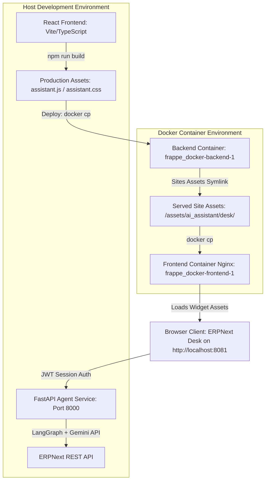

# ERPNext AI Assistant

An elegant, fully-integrated AI Assistant widget for ERPNext Desk built using Frappe, React, TypeScript, Vite, LangGraph, and FastAPI.

The assistant is injected globally into the ERPNext Desk UI, providing an interactive sidebar chat interface powered by an intelligent agent workflow without modifying any core ERPNext or Frappe files.

---

## Architecture Overview



### Key Components

- **[`ai_assistant/hooks.py`](./ai_assistant/hooks.py)**: Registers global asset includes (`app_include_js` and `app_include_css`) in Frappe Desk.
- **[`ai_assistant/ai_assistant/api.py`](./ai_assistant/ai_assistant/api.py)**: Whitelisted Frappe REST endpoint (`get_chat_token`) that signs JWT tokens using the session user's identity.
- **[`frontend/`](./frontend/)**: React + Vite + TypeScript chat widget embedded into ERPNext Desk.
- **[`agent/`](./agent/)**: FastAPI service running a multi-turn LangGraph state machine with Gemini LLM intent classification, slot filling, and ERPNext REST API integration.
- **[`skills/`](./skills/)**: Declarative skill specifications (`check-inventory`, `create-sales-order`, `customer-lookup`).

---

## Prerequisites

Before starting, ensure you have the following installed:
1. **Python 3.10+** (with `pip` and `venv`)
2. **Node.js 18+** (with `npm`)
3. **Docker Desktop** running the ERPNext multi-container bench (`frappe_docker-backend-1`, `frappe_docker-frontend-1`, etc.) reachable at `http://localhost:8081`.

---

## Quick Start & Installation Guide

### Step 1: Clone the Integration Branch

Clone the repository specifically on the **`integration-wip`** branch:

```bash
git clone -b integration-wip https://github.com/Picture-Sque/erpnext-ai-assistant.git
cd erpnext-ai-assistant
```

---

### Step 2: Install Frappe App in Bench

Inside your Frappe bench environment (or container), fetch and install the app onto your site:

```bash
# Get the app on the integration-wip branch
bench get-app https://github.com/Picture-Sque/erpnext-ai-assistant.git --branch integration-wip

# Install onto your site (e.g. frontend)
bench --site frontend install-app ai_assistant
```

---

### Step 3: Configure and Start the FastAPI Agent Backend

Navigate to the `agent` directory, set up your Python virtual environment, install dependencies, configure environment variables, and start the server:

```bash
cd agent

# Create and activate virtual environment
python -m venv venv

# Windows PowerShell:
.\venv\Scripts\activate

# Linux / macOS:
# source venv/bin/activate

# Install requirements
pip install -r requirements.txt

# Create environment config from example
cp .env.example .env
```

Edit `agent/.env` to configure your credentials:

```env
# Shared JWT Secret matching Frappe site secret
JWT_SECRET=your_jwt_secret_here

# Dev Mock Authentication Fallback (set to false for production session auth)
ALLOW_DEV_MOCK_AUTH=false

# ERPNext REST API Connection
ERPNEXT_BASE_URL=http://localhost:8081
ERPNEXT_API_KEY=your_erpnext_api_key
ERPNEXT_API_SECRET=your_erpnext_api_secret

# Google Gemini API Key
GOOGLE_API_KEY=your_gemini_api_key
```

Launch the FastAPI Agent server:

```bash
python -m uvicorn main:app --host 127.0.0.1 --port 8000
```

*The agent service runs on `http://127.0.0.1:8000`.*

---

### Step 4: Compile Frontend Assets & Deploy to Docker Containers

From the repository root, build the React frontend production bundle:

```bash
cd frontend
npm install
npm run build
```

This compiles assets into `ai_assistant/public/desk/assistant.js` and `assistant.css`.

Now synchronize the compiled assets to your running Docker containers:

```bash
# 1. Copy assets to Backend container application directory
docker cp ../ai_assistant/public/desk/assistant.css frappe_docker-backend-1:/home/frappe/frappe-bench/apps/ai_assistant/ai_assistant/public/desk/assistant.css
docker cp ../ai_assistant/public/desk/assistant.js frappe_docker-backend-1:/home/frappe/frappe-bench/apps/ai_assistant/ai_assistant/public/desk/assistant.js

# 2. Copy assets to Backend container site assets symlink
docker cp ../ai_assistant/public/desk/assistant.css frappe_docker-backend-1:/home/frappe/frappe-bench/sites/assets/ai_assistant/desk/assistant.css
docker cp ../ai_assistant/public/desk/assistant.js frappe_docker-backend-1:/home/frappe/frappe-bench/sites/assets/ai_assistant/desk/assistant.js

# 3. Copy assets to Frontend Nginx container site assets
docker cp ../ai_assistant/public/desk/assistant.css frappe_docker-frontend-1:/home/frappe/frappe-bench/sites/assets/ai_assistant/desk/assistant.css
docker cp ../ai_assistant/public/desk/assistant.js frappe_docker-frontend-1:/home/frappe/frappe-bench/sites/assets/ai_assistant/desk/assistant.js
```

---

### Step 5: Clear Cache and Refresh Desk

Run `bench clear-cache` inside the backend container so Frappe links the app hooks:

```bash
docker exec frappe_docker-backend-1 bench --site frontend clear-cache
```

---

## Verification & Usage

1. Open **`http://localhost:8081`** in your browser.
2. Log into ERPNext Desk using test user credentials:
   - **Administrator**: `Administrator` / `admin`
   - **Employee**: `employee@test.com` / `password123`
3. Click the floating AI Assistant chat launcher in the bottom-right corner.
4. **Try test prompts**:
   - **Customer Lookup**: `"Look up customer West View Software Ltd."`
   - **Stock Check**: `"Check stock for SKU005"`
   - **Sales Order Creation**: `"Create a sales order for Grant Plastics Ltd. for 5 units of SKU001"`

---

## Repository Branching Strategy

- **`integration-wip`** *(Main Integration Branch)*: Complete, self-contained MVP branch containing the React Desk widget, FastAPI backend, LangGraph workflow, skills, JWT authentication, and Docker synchronization procedures.

---

## License

This project is licensed under the MIT License.
