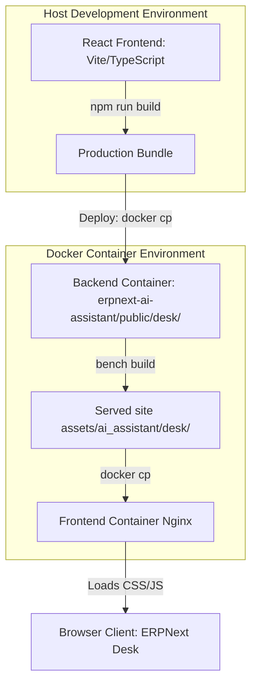

# ERPNext AI Assistant

An elegant, fully-integrated AI Assistant widget for ERPNext Desk built using Frappe, React, TypeScript, and Vite.

The assistant is injected globally into the ERPNext Desk UI, providing an interactive sidebar chat interface without modifying any core ERPNext or Frappe files.

---

## Architecture Overview

The project is structured as a standard Frappe application containing a custom React frontend.



### Key Components

- **[`ai_assistant/hooks.py`](file:///c:/Users/krish/Desktop/ai_assistant/erpnext-ai-assistant/ai_assistant/hooks.py)**: Configures global injection of assets into the Desk using `app_include_js` and `app_include_css`.
- **[`frontend/`](file:///c:/Users/krish/Desktop/ai_assistant/erpnext-ai-assistant/frontend)**: The React + Vite + TypeScript project.
- **[`frontend/src/main.tsx`](file:///c:/Users/krish/Desktop/ai_assistant/erpnext-ai-assistant/frontend/src/main.tsx)**: Dual-root mounting strategy. Checks for isolated `#ai_assistant-root` mount point first (preventing layout clobbering in multi-framework environments), falling back to `#root` for standalone dev server.
- **[`frontend/src/components/desk/assistant-shell.tsx`](file:///c:/Users/krish/Desktop/ai_assistant/erpnext-ai-assistant/frontend/src/components/desk/assistant-shell.tsx)**: Handles the sliding transition states, accessibility (ARIA attributes), click-outside-to-close dismissals, ESC key event listener, and a keyboard focus trap.
- **[`frontend/src/styles/global.css`](file:///c:/Users/krish/Desktop/ai_assistant/erpnext-ai-assistant/frontend/src/styles/global.css)**: Holds all styles. Formatted with strict class scoping (prefixed with `#ai_assistant-root`, `.desk-assistant`, `.chat-`, or `.app-shell`) to prevent styling or CSS reset leaks onto the parent ERPNext Desk UI.

---

## Installation & Setup

### 1. Backend Installation (Frappe Bench)
Add the application to your Frappe bench:
```bash
bench get-app https://github.com/your-username/erpnext-ai-assistant.git --branch main
bench --site your-site-name install-app ai_assistant
```

### 2. Frontend Development Setup
Navigate to the frontend folder and install dependencies:
```bash
cd erpnext-ai-assistant/frontend
npm install
```

To run the standalone frontend in hot-reload development mode:
```bash
npm run dev
```
Open `http://localhost:5173` to interact with the static chat workspace.

---

## Production Build & Container Deployment

Vite is configured to compile assets directly into the Frappe public folder:
`../ai_assistant/public/desk/` as `assistant.js` and `assistant.css`.

### Step 1: Compile the production assets
From the `frontend` directory, run:
```bash
npm run build
```

### Step 2: Synchronize assets to the Docker containers
In multi-container production environments (where backend python processes and frontend nginx proxies run in separate containers), the compiled assets must be synchronized.

1. **Deploy to the Backend Container**:
   Copy the assets into the baked application folder inside the container:
   ```bash
   docker cp ai_assistant/public/desk/assistant.css frappe_docker-backend-1:/home/frappe/frappe-bench/apps/ai_assistant/ai_assistant/public/desk/assistant.css
   docker cp ai_assistant/public/desk/assistant.js frappe_docker-backend-1:/home/frappe/frappe-bench/apps/ai_assistant/ai_assistant/public/desk/assistant.js
   ```

2. **Sync the Site Assets Symlink**:
   Frappe links the site public directory to a local bench `assets` folder. Copy the files and update the symlinks inside both containers:
   ```bash
   # Backend Container Sites Sync
   docker cp ai_assistant/public/desk/assistant.css frappe_docker-backend-1:/home/frappe/frappe-bench/sites/assets/ai_assistant/desk/assistant.css
   docker cp ai_assistant/public/desk/assistant.js frappe_docker-backend-1:/home/frappe/frappe-bench/sites/assets/ai_assistant/desk/assistant.js
   
   # Frontend Nginx Container Sites Sync
   docker cp ai_assistant/public/desk/assistant.css frappe_docker-frontend-1:/home/frappe/frappe-bench/sites/assets/ai_assistant/desk/assistant.css
   docker cp ai_assistant/public/desk/assistant.js frappe_docker-frontend-1:/home/frappe/frappe-bench/sites/assets/ai_assistant/desk/assistant.js
   ```

### Step 3: Clear Redis and Site Cache
If the application hooks do not show up immediately, it is because of Redis caching key hashes:

1. **Append the app to `apps.txt`** (if not already present):
   ```bash
   docker exec frappe_docker-backend-1 sh -c "echo 'ai_assistant' >> /home/frappe/frappe-bench/sites/apps.txt"
   docker exec frappe_docker-frontend-1 sh -c "echo 'ai_assistant' >> /home/frappe/frappe-bench/sites/apps.txt"
   ```

2. **Clear the cached Redis keys** inside the backend container console:
   ```bash
   docker exec frappe_docker-backend-1 bench --site frontend execute "frappe.cache.delete_value" --args "all_apps"
   docker exec frappe_docker-backend-1 bench --site frontend execute "frappe.cache.delete_value" --args "app_hooks"
   ```

3. **Clear site configuration and template cache**:
   ```bash
   docker exec frappe_docker-backend-1 bench --site frontend clear-cache
   ```

---

## Contributing & Pre-Commit

This repository uses `pre-commit` hooks to format and lint code before committing.
To install pre-commit:

```bash
pip install pre-commit
pre-commit install
```

Pre-commit runs formatting checks using:
- **ruff** (Python formatting)
- **eslint** / **prettier** (TypeScript & React formatting)
- **pyupgrade** (Modern Python syntax verification)

---

## License

This project is licensed under the MIT License.
